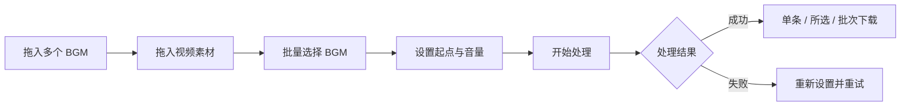

<div align="center">

# 🎬 视频配乐批量处理

**在 Mac 本地为大量视频快速分配、裁切并烧录 BGM**

[](#系统要求)
[](#系统要求)
[](#隐私与本地数据)
[](LICENSE)

无需上传云端，无需安装复杂的视频编辑软件。拖入视频与音乐、完成批量设置，然后一次生成全部成品。

</div>

---

## ✨ 功能亮点

| 功能 | 说明 |
| --- | --- |
| 🎵 不限数量 BGM | 支持一次拖入多个 MP3、M4A、WAV 或 AAC 文件 |
| 🎞️ 批量导入视频 | 支持 MP4、MOV、M4V，可连续拖入并显示缩略图与预览 |
| 🎨 BGM 颜色标记 | 每首音乐使用独立颜色，快速辨认视频与音乐的对应关系 |
| ⚡ 批量分配 | 勾选多条视频后，一次指定 BGM 和音乐起点 |
| ⏱️ 递进起点 | 例如从 0 秒开始，每条视频自动增加 10 秒 |
| 🔊 替换或混音 | 可覆盖原音，也可保留原音并分别调节两路音量 |
| ↕️ 自定义顺序 | 拖拽调整视频顺序，并按 `1.mp4`、`2.mp4`……输出 |
| ♻️ 失败重试 | 失败项目独立显示，可重新设置并再次处理 |
| 📦 灵活下载 | 支持单条、勾选项或按处理批次下载 |
| 🔒 本地处理 | 视频、音乐和成品始终保存在你的 Mac 上 |

## 🧭 工作流程



## 🚀 快速开始

### 1. 下载项目

点击 GitHub 页面右上方的 **Code → Download ZIP**，解压后进入项目文件夹；也可以使用 Git：

```bash
git clone https://github.com/Myeonghan726/video-audio-batch-tool.git
cd video-audio-batch-tool
```

### 2. 启动工具

> [!WARNING]
> 从 GitHub 下载的脚本没有 Apple Developer 签名。macOS 首次打开时可能提示“Apple 无法验证是否包含恶意软件”。这是 Gatekeeper 对互联网下载脚本的常规拦截，并不代表项目文件损坏。

#### 方法 A：不用终端（最直观）

1. 在警告弹窗中点击“完成”。
2. 打开 **系统设置 → 隐私与安全性**。
3. 向下滚动到“安全性”，点击该脚本旁边的 **仍要打开**。
4. 再点击“打开”确认；以后就可以正常双击启动。

“仍要打开”通常只在尝试启动后的一小时内显示。参见 [Apple 官方说明](https://support.apple.com/zh-cn/guide/mac-help/mh40616/mac)。

#### 方法 B：复制一行命令（最快）

如果项目位于默认下载目录，打开“终端”，复制下面整行、粘贴并按回车：

```bash
xattr -dr com.apple.quarantine "$HOME/Downloads/video-audio-batch-tool-main" && open "$HOME/Downloads/video-audio-batch-tool-main/启动BGM批处理工具.command"
```

这条命令只解除该项目文件夹的隔离并立即启动工具，不会关闭整台 Mac 的安全保护。如果你把项目解压到了其他位置，可先输入 `xattr -dr com.apple.quarantine `（末尾保留一个空格），再把整个项目文件夹拖进终端窗口并按回车。

解除首次拦截后，直接双击以下文件即可：

```text
启动BGM批处理工具.command
```

首次启动会根据当前 Mac 架构自动编译 AVFoundation 处理引擎，随后浏览器会自动打开本地操作页面。

> [!IMPORTANT]
> 使用期间请不要关闭启动后的终端窗口。不要直接打开 `static/index.html`，页面必须通过本地服务运行。

### 3. 批量处理

1. 将一首或多首音乐拖入“音乐素材库”。
2. 将视频拖入“分配视频和音乐”区域。
3. 勾选视频，批量应用 BGM；也可以逐条设置。
4. 设置首条音乐起点与递增秒数，点击“设置递进起点”。
5. 选择“替换原音”或“视频混音”，确认音量。
6. 点击“开始处理”，通过进度条查看状态。
7. 在“处理完成”中下载单条、所选项目或对应处理批次。

## 🔊 音频设置参考

| 使用场景 | 原素材音量 | BGM 音量 | 建议 |
| --- | ---: | ---: | --- |
| 完全替换原音 | 静音 | `0 dB` | 适合无声素材或只需要配乐的视频 |
| 保留人声/现场声 | `-6 dB` | `-18 dB` | BGM 更自然地处于背景位置 |
| 自定义混音 | `-60～12 dB` | `-60～12 dB` | 使用滑杆试听并按素材实际响度调整 |

BGM 起点超出音乐尾部时会循环计算；音乐长度不足视频时，也会自动从头循环直至覆盖视频时长。

## 🖥️ 系统要求

- macOS 12 或更高版本。
- Python 3。
- Xcode Command Line Tools，用于编译 Swift/AVFoundation 视频处理引擎。

检查 Python：

```bash
python3 --version
```

安装 Xcode Command Line Tools：

```bash
xcode-select --install
```

如果 macOS 首次阻止启动脚本，请按照上方“启动工具”中的 Gatekeeper 处理方法解除下载目录的隔离标记。

## 📁 支持格式与输出

| 类型 | 格式 |
| --- | --- |
| 视频输入 | MP4、MOV、M4V |
| 音频输入 | MP3、M4A、WAV、AAC |
| 视频输出 | MP4 |

- 输出视频保持源素材的画面比例、分辨率和时长。
- 视频轨道优先使用无损直通导出；无法直通时使用系统最高质量预设。
- 所有处理均由 macOS AVFoundation 在本机完成。

## 🗂️ 页面说明

- **输入队列**：上传、排序并设置 BGM、起点和音频参数。
- **处理失败**：查看失败原因，将项目移回输入队列后重新设置。
- **处理完成**：下载成品、重新处理或删除不再需要的项目。
- **处理批次**：按每次点击“开始处理”的时间分别保存下载入口，避免不同批次混在一起。

## 🔐 隐私与本地数据

本工具只监听 `127.0.0.1`，不会把素材发送到互联网。

| 数据 | 本地位置 |
| --- | --- |
| 上传缓存 | `输入缓存/` |
| 处理成品 | `处理完成/` |
| 会话状态 | `.batch-session.json` |

以上运行数据均已写入 `.gitignore`，不会被提交到 GitHub。页面中删除素材时，对应的本地缓存或成品也会同步删除。

## 🛠️ 常见问题

<details>
<summary><strong>提示“Apple 无法验证是否包含恶意软件”</strong></summary>

这是未签名开源脚本被 macOS Gatekeeper 隔离。请使用“启动工具”章节中的 `xattr` 命令解除项目文件夹的下载隔离标记。命令只作用于你指定的项目目录。

</details>

<details>
<summary><strong>页面只有文字，没有正常样式</strong></summary>

请关闭该页面，双击 `启动BGM批处理工具.command` 后使用自动打开的新页面。不要直接打开 `static/index.html`。

</details>

<details>
<summary><strong>显示 Failed to fetch 或一直停留在“上传中”</strong></summary>

确认启动终端仍在运行，然后刷新由脚本自动打开的最新 `127.0.0.1` 页面。旧标签页使用的端口可能已经失效。

</details>

<details>
<summary><strong>首次启动提示缺少开发工具</strong></summary>

在终端执行 `xcode-select --install`，安装完成后重新双击启动脚本。

</details>

<details>
<summary><strong>为什么不提供 Windows 版本？</strong></summary>

当前处理引擎基于 macOS AVFoundation，因此暂时仅支持 Mac。

</details>

## 🧩 项目结构

```text
video-audio-batch-tool/
├── native/bgm_mux.swift          # AVFoundation 视频处理引擎
├── static/                       # 本地网页界面
├── server.py                     # Python 本地服务与任务管理
├── 启动BGM批处理工具.command      # 一键启动脚本
├── 输入缓存/                     # 本地上传缓存（Git 忽略）
└── 处理完成/                     # 本地成品目录（Git 忽略）
```

## 📄 开源许可

本项目基于 [MIT License](LICENSE) 开源。你可以自由使用、修改和分发，但请保留原许可证与版权声明。

<div align="center">

Made with care by **Matthew**

</div>
